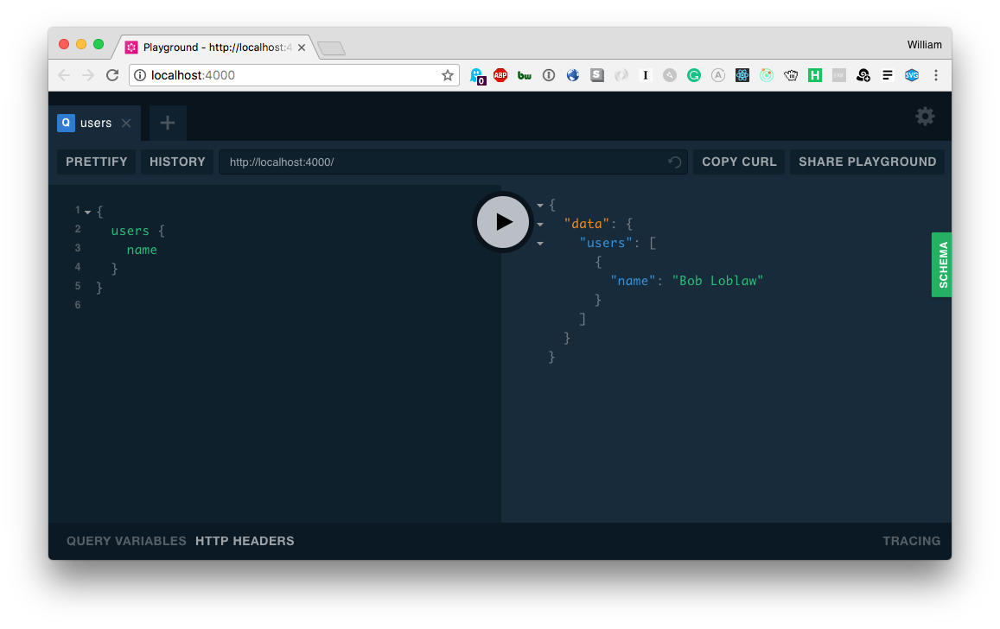

# GRANDstack Starter

This project is a starter for building a [GRANDstack](https://grandstack.io) (GraphQL, Angular, Apollo, Neo4j Database) application. There are two components to the starter, the UI application (a React app) and the API app (GraphQL server).

[]
## Neo4j
### Local setup
1. [Download Neo4j Server](https://neo4j.com/download-center/#community)
2. Unzip
3. cd ./bin && run cmd there
4. Run command: neo4j console
5. Go to localhost:7474
6. Username && password: neo4j
7. Set new password to root

### [`/api`](./api)

*Install dependencies*

```
(cd ./PraviUI && npm install)
(cd ./api && npm install)
```

*Start API server*
```
cd ./api && npm start
```



### [`/ui`](./praviUI)

This will start the GraphQL API in the foreground, so in another terminal session start the UI development server:

*Start UI server*
```
cd ./praviUI && ng serve
```


See [the project releases](https://github.com/grand-stack/grand-stack-starter/releases) for the changelog.

This project is licensed under the Apache License v2.
Copyright (c) 2018 Neo4j, Inc.
